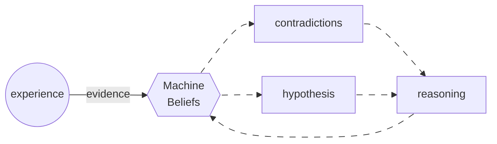

# The Art of Learning From Contradictions

This essay presents a new algorithm for learning from contradictions. Imagine a machine that observes evidence and makes guesses about the hidden rules generating what she sees. When new evidence contradicts her guesses, she revises them using the principle of the exception—the old legal idea that an exceptional case, by being recognized as an exception, legitimates a rule in all other cases.

In order to make guesses, the machine uses the Infant language which consists of three simple means—resemblance, distinction, and conclusion—that mimic how infants distinguish things and draw conclusions. Despite its simplicity, the language allows the machine to learn a symbolic representation of the program that is consistent with the evidence observed so far.

------

**Disclaimer**

This is personal work and original research.

Status: draft / work in progress.

Request: Please, do not circulate.

------

## Introduction

An **epistemic machine** is a machine that can explain her thinking, which means that her beliefs are grounded on evidence. The machine receives evidence through a stream of experience. Hence, we can think of experience as a program that generates the data points observed by the machine, and we call these data points *bits of evidence*. From the perspective of an epistemic machine, *thinking* is the process of drawing conclusions from her beliefs. Evidence and beliefs can be expressed as *inferential programs* because they rely on the implicit idea of a **before** and an **after**. In particular, what comes *before* is said to be the **condition**, whereas what comes after is said to be the **outcome**. The following snippet shows how we will encode evidence throughout the essay.

```
evidence |  x1   x2   x3  |  outcome   |                  belief 
--------------------------------------------------------------------------------
w0       |  a    b    c   |  q         | x1=a x2=b x3=c then Outcome = q
...            ...           ...
wn       |  f    m    d   |  z         | x1=f x2=m x3=d then Outcome = z
```

> **Experience**
>
> Experience is a stream of evidence representing different executions of the same program against different input data. The condition represents the input of the computation implied by the experience whereas the outcome represents the output of the computation.

Without the primitive ability to distinguish things, there would be no 'before' and 'after' in the first place. Starting from this ability and the fact that time flows in a single direction (at least, this is what we experience), infants begin exploring their surroundings, learning how to draw conclusions by comparing simple states. Eventually, an infant discovers that the state in which a toy is broken is undesirable and that she must stop throwing toys from a height.

Epistemic machines mimic the ability of infants through a simple language, the Infant Language, which allows them to represent the world as they experience it.

A belief is an expression of the following kind

```
if some condition is met
  then believe the outcome (fire)
  else suspend judgment (abstain)
```

The Infant Language consists of three means, the *means of resemblance* '=', the *means of distinction* '!=', and the *means of conclusion* 'then'.

> **The Infant Language**
>
> The means '=' and '!=' test equality/inequality between variables (returning 'yes'/'no'), while 'then' assigns outcomes based on these tests.

Despite its simplicity, the Infant Language is surprisingly expressive. To make the point, let us challenge ourselves with a familiar example: suppose we are asked to explain the logical operator **and** to a person who is new to logic.

Suppose we are asked to explain to a person who is new to logic the meaning of the logical operator **and**. Perhaps, the most conventional approach would be to explain the meaning of the logical operators using its truth table

```
x1     x2     x1 and x2
yes    yes          yes
yes    no           no
no     yes          no
no     no           no
```

However, this approach has a flaw and we may agree with Socrates that enumerating all possible cases does not constitute an explanation of the matter. How could one in fact possibly compute the result of the operator without learning by heart the entire table? Hence, in this situation an explanation is *imperative knowledge* that explains the step one has to make in order to accomplish something, that is, equivalently, a contingent plan of actions (a strategy) or, more familiarly, a *program*.

To make this plan real, we use the Infant Language and the principle of resemblance, a judgment based on resemblance. For the moment, let us ignore many important nuances and let us think about resemblance as equality.

Because the **and** program is a *boolean function* operating on binary values, either the inputs are the same or they are not. It can't be otherwise, or there are no inputs in the first place. This observation—that we need only distinguish between equality and inequality—allows us to enrich the truth table of **and** by translating each row into expressions of the Infant Language.

With this in mind, the truth table becomes

```
    x1     x2     x1 and x2                 belief
b1  yes    yes          yes       x1 = x2 = yes then Outcome = x1 = yes
b2  yes    no           no        x1 != x2 then Outcome = x2 = no
b3  no     yes          no        x1 != x2 then Outcome = x1 = no
b4  no     no           no        x1 = x2 = no then Outcome = x1 = no
```

In order to choose which means applies we compared the inputs. In row 1 and 4, because the inputs are the same we express our belief using '=', in the remaining cases we use '!='.

By inspecting the table we notice that row 1 and row 4 are the same thing, also row 2 and row 3 are the same thing. Therefore, the explanation we were looking for can be succinctly described as an inferential program, a small epistemic machine

```
b1 x1 = x2  then Outcome = x1.
b2 x1 != x2 then Outcome = no.
```

Because of its epistemic nature, this program is more general than what we may be tricked to think. To see this point clearly, let us try to apply the same reasoning to the particle connector *and* of natural languages.

```
Luca and Francesca are friends.
```

The sentence seems reasonable because we have an abstract idea of "Luca" and "Francesca" as persons, and persons can indeed be friends. It therefore makes sense to compose personal names within the same relationship of 'being friends'. This idea of composition based on shared properties is already encoded in the pair of beliefs we defined.

To convince ourselves, let us evaluate our beliefs against the following pair of observations `person, person`, `person, stone`, `stone, stone`

> **Rule for evaluating beliefs**
>
> For any belief, answer to the question: is the condition satisfied?
>
> If the answer is 'yes', then believe the outcome (fire)
>
> Else, the answer is 'no', therefore do nothing (abstain)

Using the usual notation we evaluate

```
x1         x2      |         |  outcome    fire
person     person  |   then  |  person     b1
person     stone   |   then  |  no         b2       
stone      stone   |   then  |  stone      b1
```

Interestingly, the first and the second pairs are evaluated correctly whereas the last pair is evaluated correctly though the evaluation is problematic. In this essay we are not concerned with the genuinely interesting case, yet, the previous example proves that the Infant Language, as it is, represents the program **and** generically—it does not operate on fixed labels like "true" or "false" but on the higher-order properties of **resemblance and distinction** themselves.

The secret of the Infant Language, if there is one, is that it is *compositional*, like Legos. The machine could play with beliefs as a child plays with Lego bricks. Here are a few examples to make the point:

```
(x1 != c) = (x2 = f) = (x3 = g)
```

or, in logical terms:

```
x1 != c and x2 = f and x3 = g.
```

The means of distinction is perhaps more interesting. In fact, the condition

```
(x1 != c) = (x1 != f)
```

means:

```
x1 is in the set X such that: x1 != c and x1 != f.
```

Hence, by simply composing relationships of resemblance and distinction, the machine can construct complex beliefs that represent non-trivial programs with logical and set-theoretical properties.

Yet expressiveness alone does not solve the epistemic problem. Having a language capable of expressing beliefs is not the same as knowing *which* beliefs to form—the property of composition alone does not explain how an epistemic machine could learn a program from experience.

Whereas an infant can actively manipulate her environment to trigger new experiences, our epistemic machine is a passive observer. The only thing she can do is explore the space of *possible beliefs* and make guesses about which ones better explain the evidence she experiences.

Then, like an infant, she will be *surprised by violated expectations*—**contradictions**—and therefore will make better guesses so that she will not repeat the same mistake when faced with similar situations in the future. This learning process is, in essence, the traditional trial-and-error method, which works well enough for radical situations of incomplete information.

The key to the algorithm consists in the strategy the machine uses to review its contradictory beliefs, **the principle of the exception**.

To understand the principle, suppose a rational Decision Maker. The decision maker is said to be rational because she grounds her beliefs on evidence so that her actions are consistent with her preferences. The Decision Maker is then presented with a new situation that seems similar to ones she has handled in the past. Because of these similarities, she takes the same action that worked well in those past similar situations. However, she is caught by surprise when the actual outcome does not match her expectation. It turns out a small difference was the devil in the detail—the exceptional cause that validated the belief's use in all other circumstances. What has been described so far is close to the legal etymology of the idiom **l'eccezione che conferma la regola**—the principle the machine will use to revise her beliefs when contradictions arise.

By repeating this process over and over again—making guesses, encountering contradictions, revising beliefs—the machine may eventually learn the program generating her experience. This feedback loop makes the machine a **dynamical system of beliefs**.



This system of beliefs, as depicted above, is the epistemic machine, *the never ending act of thinking in the Infant Language*.

The remainder of the essay is organized as follows. In the next section, we introduce the art of making guesses using the principle of resemblance; then we will role-play as the machine against a stream of evidence. This will prove or disprove our experiment. Finally, in the conclusion, I will try to shed some light on the computational model implied by this work, that of Propagation Networks, and other due technical details.

## Making Guesses & Learning

The secret to the trial-and-error method is, fundamentally, luck. Any problem that can be solved by trial and error starts with a guess. A good guess accelerates the journey; a bad one simply makes the path more scenic. The same is true for the machine and her epistemic problem: understanding the program that generates her experience. Without the ability to make guesses, the machine could not learn in the first place. 

In order to understand the problem of generating guesses from the perspective of an epistemic machine, we could simulate an infant machine that, with no prior knowledge of anything, faces for the first time a new piece of evidence. Let this new bit of evidence be the following record

```
x1   x2   x3   outcome   
a    f    f    g        
```

Intuitively, we may be tempted to make the bold hypothesis that the resemblance between `x2` and `x3` is the *cause* of the outcome—the same kind of reasoning we used with the **and** operator in the previous section. In the language of the machine, the guess becomes

```
x2 = x3 then outcome = g.
```

The previous belief is **legitimate** because it is justified by the evidence. Furthermore, because it is not contradicted by prior beliefs or evidence, the guess is also **consistent** with what the machine knows so far. Finally, it is also **general**. In fact, there are no exceptions to the means of resemblance, it holds generally for any possible pair `(x2, x3)` such that `x2 = x3`.

Let us consider another legitimate belief, for example

```
(x1 = a) = (x2 = f) then outcome = g.
```

Unlike the previous belief, this belief depends on particular types for `x1` and `x2` and, because of that, is less general. There are many other possible legitimate guesses, however, instead of enumerating them all, we should propose a good strategy for selecting quickly one or many guesses. One principled approach would therefore be to favor guesses by generality so that exceptional cases can be appended as contradictions emerge. In fact, only future observations may prove or disprove a belief. In the following section, when simulating the process of learning, the machine will use this principled strategy for generating guesses.

Before jumping into this exercise of radical learning, however, we need three essential definitions.

- A piece of evidence is **informative** if, for all current beliefs, its condition is **not** satisfied.
- A belief is **contradictory** if there exists a piece of evidence for which its predicted outcome does not match the observed outcome.
- A piece of evidence is **ambiguous** if there exist at least two events where the same variable assignments lead to different outcomes.

The first definition tells us that if the machine observes new evidence that can be explained by an existing belief, then the evidence is not informative; the program learned so far would already produce the correct output. The second definition tells us that if a new piece of evidence triggers a **wrong**—that is, a belief that fires but proposes an incorrect outcome—then that belief is contradictory. Hence, being contradictory is a property of a belief, not of the evidence. Finally, the last definition describes what it means for a piece of evidence to be ambiguous.

To appreciate this definition, consider the following evidence:

```
w    x1     x2    Outcome
w1   a      a       y
w2   a      a       q
```

These events share the same condition but suggest a contradiction. However, experience itself cannot be contradictory; at most, it can be misleading due to a lack of observation of missing variables. There might in fact be an `x3`:

```
w    x1     x2    x3   Outcome
w1   a      a     g     y
w2   a      a     h     q
```

that explains the difference. In the following section, without jeopardizing the core intuitions, we will work from the assumption that the process generating the observed evidence is deterministic and there is no noise in the transmission of information.

## Radical Learning

So far, we accepted the idea of an epistemic machine that can be said rational if she possesses a strategy for making guesses and a strategy to review her contradictory beliefs. We could say that the rational machine reflects the proverb *errare è umano, perseverare è diabolico*. In fact, instead of persisting in her mistakes, the machine will apply the principle of the exception to refine her guesses in such a way that her beliefs remain consistent and efficient.

We are going to simulate the process of learning against an unknown program **S** and we are going to unravel it constructively. We model time in steps. At each step, the machine receives a new piece of evidence **w_n** from the stream of experience and processes it immediately. Throughout this process, the machine maintains a **registry**—a memory structure where she stores her beliefs along with their provenance (whether justified by evidence or merely plausible speculation). The registry allows her to track which beliefs have proven useful and to identify when one belief makes another redundant through subsumption.

Let us now impersonate the machine through this narrative, thinking as she thinks.

------

##### Step 0

In step 0 there is nothing, so we are ready to continue. **Continue**

------

##### Step 1

In step 1 we observe the first piece of evidence **w1**

```
w1   a    f    f     good
```

Following our strategy from the previous section, we identify the resemblance between `x2` and `x3` as the most general pattern. We formulate our guesses:

```
b1  x2 = x3  then Outcome = good
b2  x2 != x3 then Outcome != good
```

The first belief, **b1**, is legitimate—directly justified by the evidence. The second, **b2**, is plausible—the logical complement that covers the remaining cases. Together they cover the space of possibilities.

We save both beliefs in the registry, marking b1 as justified and b2 as plausible. We are ready to continue. **Continue**

------

##### Step 2

In step 2 we observe the piece of evidence **w2**

```
w2   c    f    f     bad
```

We realize that belief **b1** is contradicted. It predicted `good` (since x2=f, x3=f satisfy the condition), but we observe `bad`. We cannot explain **w2** with our current beliefs.

We must now apply the **principle of the exception**. Instead of discarding b1 entirely, we ask: what makes w2 exceptional compared to w1?

```
w1:  x1=a,  x2=f,  x3=f  →  good
w2:  x1=c,  x2=f,  x3=f  →  bad
```

The distinguishing feature is `x1=c`. This is the exceptional case that invalidates our original rule.

Following the principle, we revise our beliefs:

**The exception confirms the rule in all other cases:**

```
b3  (x1 != c) = (x2 = x3) then Outcome = good
```

This is b1 refined—it holds everywhere except the exceptional case.

**The exceptional case becomes its own rule:**

```
b4  x1 = c then Outcome = bad
```

**We generate plausible complements to cover remaining possibilities:**

```
b5  x1 != c then Outcome != bad
b6  (x1 = c) = (x2 = x3) then Outcome = bad
```

Notice that b6 is more specific than b4 (it adds the condition x2=x3), making it somewhat redundant, though not yet obviously so.

**We retain the earlier plausible belief:**

```
b2  x2 != x3 then Outcome != good
```

Our registry now contains: b2, b3, b4, b5, b6. We mark b3 and b4 as justified by evidence, the others as plausible. We have restored consistency—both w1 and w2 can now be explained without contradiction. We are ready to continue. **Continue**

------

##### Step 3

In step 3 we observe the piece of evidence **w3**

```
w3   b    e    g     bad
```

First, the good news: belief **b2** fires correctly. Since x2=e and x3=g (x2 ≠ x3), b2 predicts `Outcome ≠ good`, which means `bad`. Indeed, we observe `bad`. Excellent.

However, we also notice that **b5** produces a contradiction:

```
b5  x1 != c then Outcome != bad
```

Since x1=b (which is ≠ c), b5 predicts `Outcome ≠ bad`, meaning `good`. But we observe `bad`.

We consult the registry and discover that b5 was generated in step 2 as a plausible complement—it was never directly justified by evidence, merely speculative. Since it is now contradicted and was never essential, we simply remove it from the registry.

Furthermore, we notice something interesting: belief **b4** (`x1=c → bad`) is more general than belief **b6** (`(x1=c) = (x2=x3) → bad`). In fact, b4 *subsumes* b6—whenever b6 applies, b4 would already give the correct answer. Keeping both is redundant. We remove b6 from the registry.

Our beliefs now become:

```
b2  x2 != x3 then Outcome != good
b3  (x1 != c) = (x2 = x3) then Outcome = good
b4  x1 = c then Outcome = bad
```

We update the registry accordingly. We are ready to continue. **Continue**

------

##### The Reveal

At this point, I shall reveal that the machine has correctly learned the program generating the data.

**The Program Generating Data**

```
Let X1 = {a, b, c}
Let X2 = {d, e, f, g, h, i}
Let X3 = X2 

if (x1 in {a, b}) and (x2 = x3)
  then Outcome = good 
  else Outcome = bad
```

The machine's three beliefs perfectly capture this logic:

- **b3**: `(x1 ≠ c) = (x2 = x3) → good` captures the case when x1 ∈ {a,b} and x2=x3
- **b2**: `x2 ≠ x3 → Outcome → bad` captures one branch of the `else` case
- **b4**: `x1 = c → bad` captures the other branch of the `else` case

Remarkably, the machine learned this from only **three observations**. Moreover, after step 3, no new piece of evidence will change these beliefs—only the registry's internal bookkeeping will update as the machine encounters more confirming examples. The machine has converged.

We have therefore demonstrated that a rational machine speaking the Infant Language can learn programs from experience using the principle of the exception.

#### Notes

The title of this work is a tribute to The Art of the Propagator, Sussman, Gerald Jay; Radul, Alexey https://dspace.mit.edu/handle/1721.1/44215.
